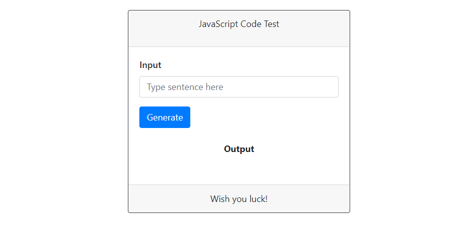
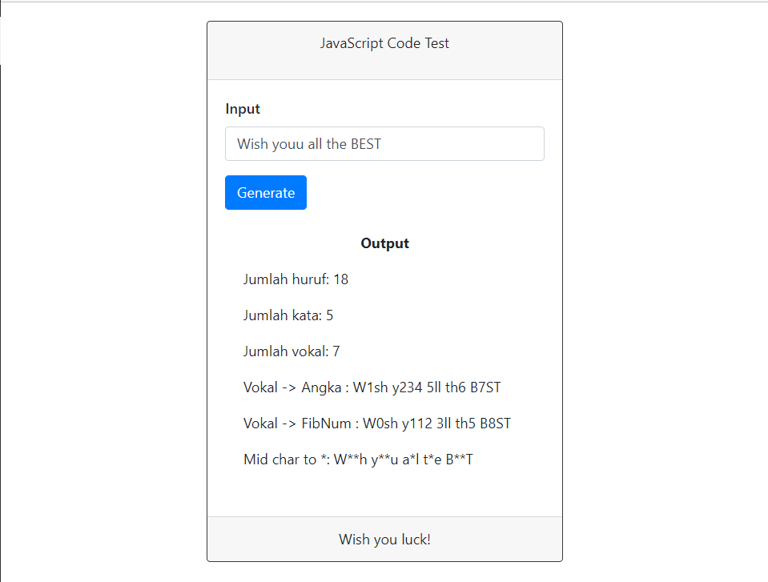

# JavaScript_BasicLearn
## Task | String Generator 
1. Counting number of string character  
2. Counting number of string word  
3. Couting number of vowels in the text  
4. Modify each vowels to sequence number  
5. Modify each vowels to fibonacci sequence number  
6. Modify each middle word to (*)  
## Preview
</img>
</img>
